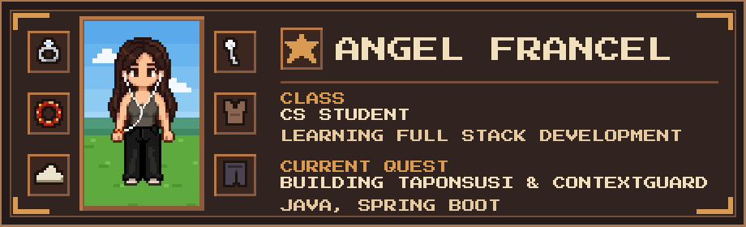
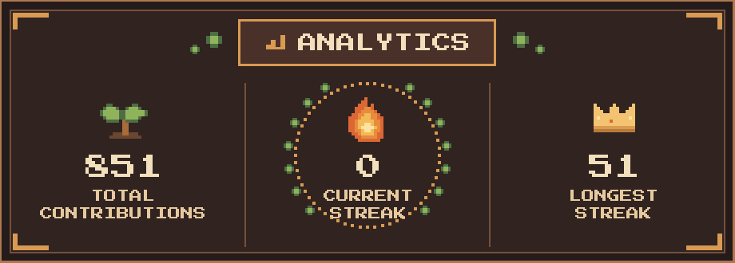
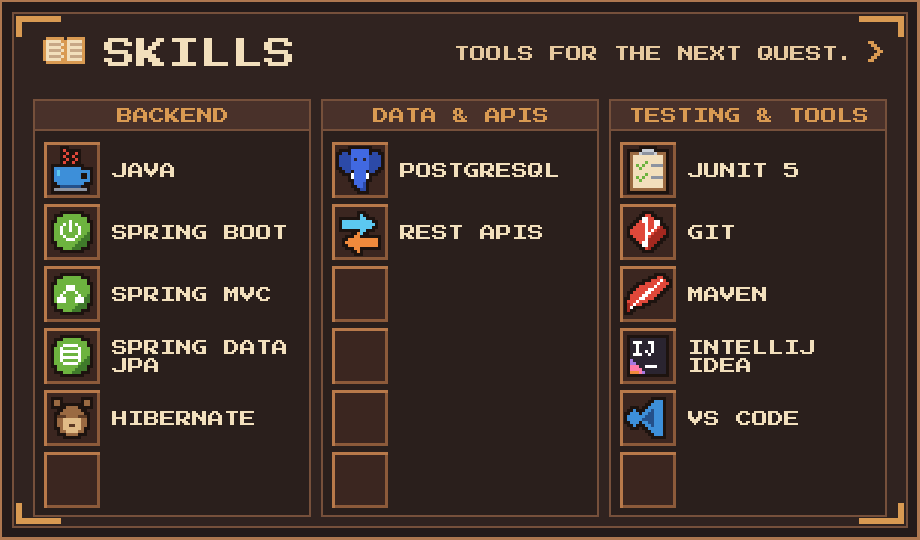
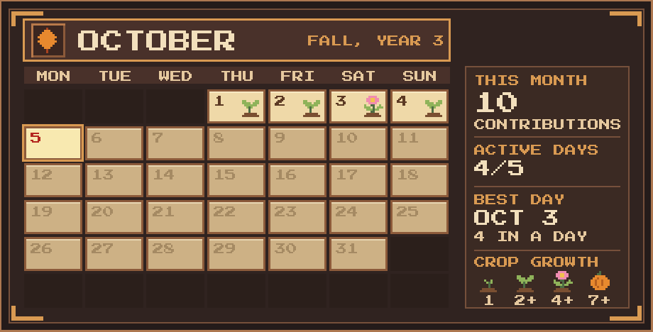
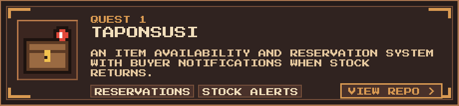
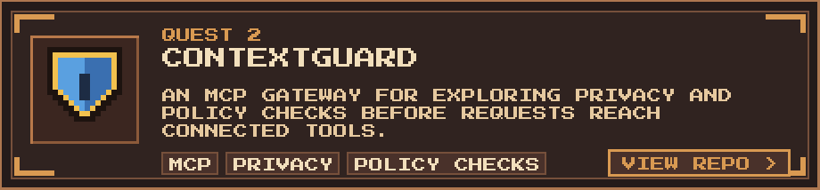
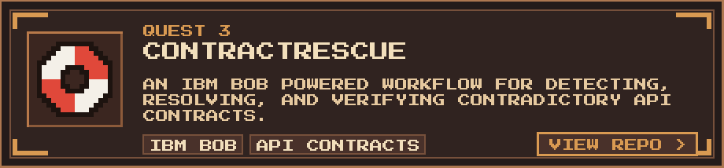

  

<table>
  <tr>
    <td width="72%" valign="middle">
      <h2>Hi, I'm Angel</h2>
      
I'm a computer science student interested in full stack development. I build Java and Spring Boot applications, and I enjoy figuring out how APIs, data, and user needs fit together.

      
<strong>Currently building:</strong> TaponSusi, an inventory and reservation system, and ContextGuard, an MCP privacy and policy gateway.

      
<em>Learning, building, and keeping an iced coffee nearby.</em>

    </td>
    <td width="28%" align="center" valign="middle">
      
    </td>
  </tr>
</table>

  

  

Skills in text

| Area | Technologies |
| :-- | :-- |
| **Languages** | Java |
| **Database** | PostgreSQL |
| **Backend** | Spring Boot · Spring MVC · Spring Data JPA · Hibernate |
| **APIs** | REST API design |
| **Testing** | JUnit 5 |
| **Tools & IDEs** | Git · Maven · IntelliJ IDEA · VS Code |

  

<!-- 

  

  

  

  

 -->

### Say Hello

You can reach me through [GitHub](https://github.com/angelfrancel). <!-- Add LinkedIn, portfolio, or email here if you want them public. -->
